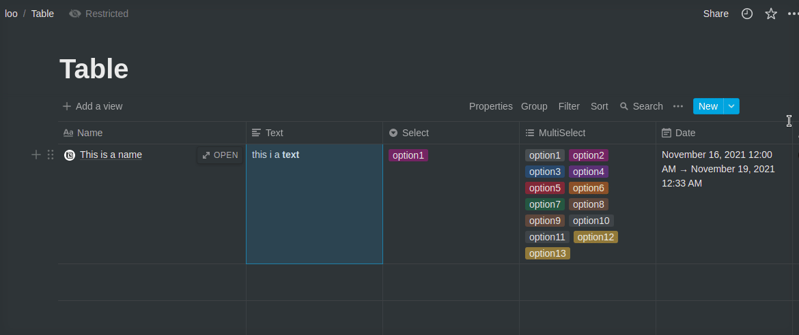
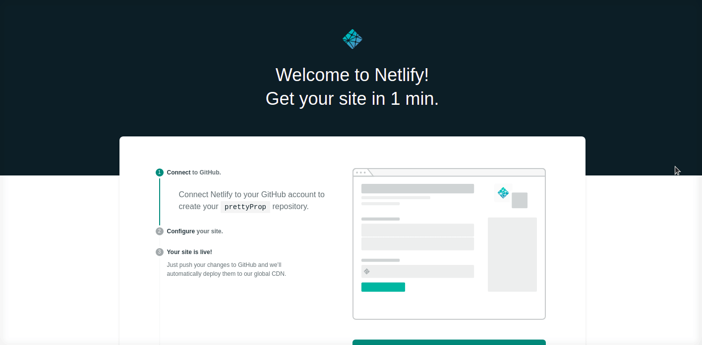
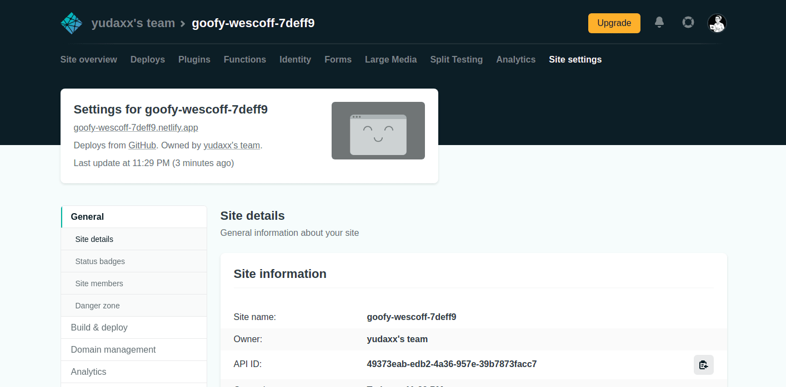

## 1.Create a Notion Integration

1.1 [Create a Notion Integration](https://www.notion.so/my-integrations)

1.2 Copy the Notion Secret

## 2. Invite the integration to your Notion table

## 3. Deploy To Netlify

3.1 Click this button

3.2 Add the Notion secret to your Site environment variables

**3.3 Trigger another Deploy**

## 4. Change the website name (OPTIONAL)

